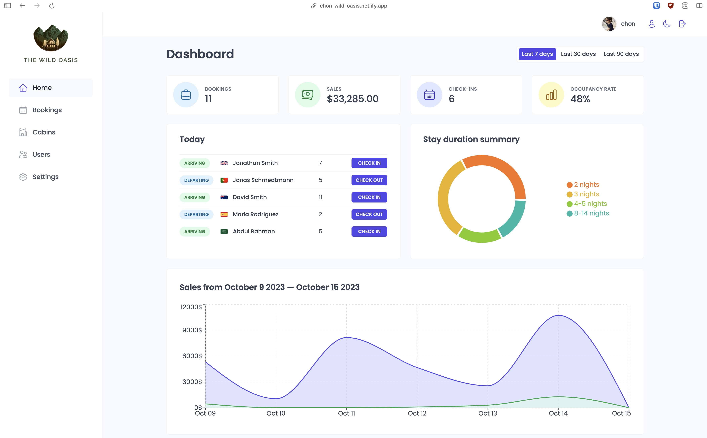
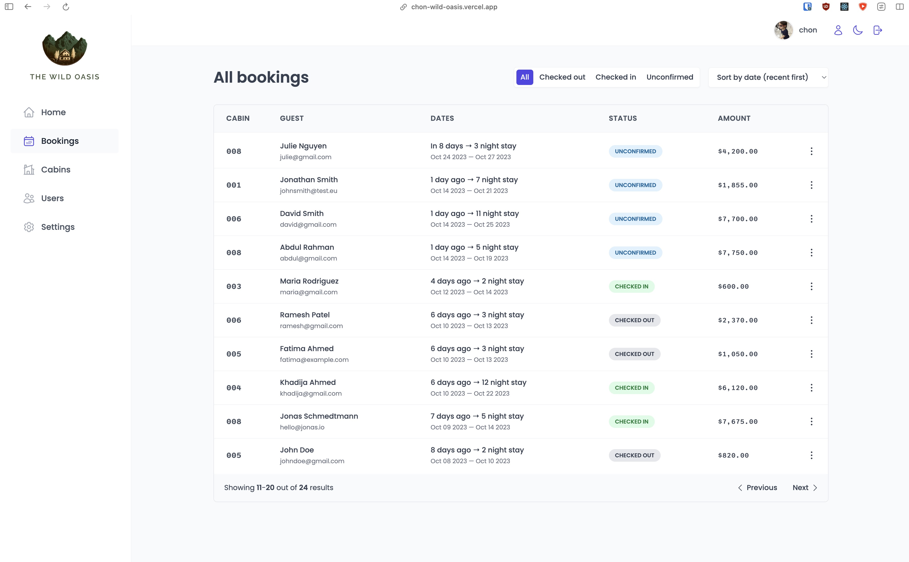
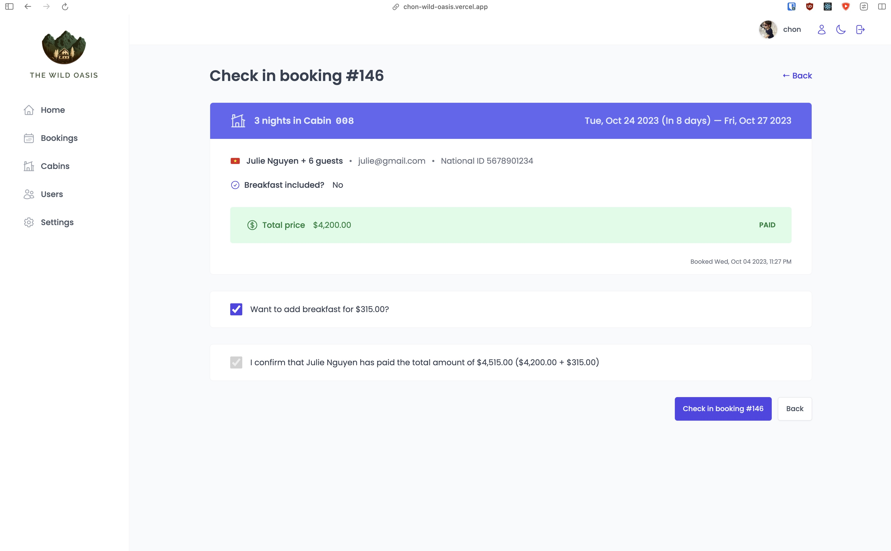

# The Wild Oasis

Simple fullstack react application made to be used as an internal platform for hotels to manage their bookings. Features an admin dashboard with charts and statistics, beautifully designed reusable styled components.
Build to highlight the use of modern libraries like `react-query`, `react-hook-form`, `supabase`, `react-hot-toast` etc.

Project based on [The Ultimate React Course 2023](https://www.udemy.com/course/the-ultimate-react-course/) by Jonas Schmedtmann.

## Getting started

Run `npm install` to install all the required dependencies. Then start the development server using `npm run dev`

```bash
$ npm install
$ npm run dev
```

> _Note_: Sending requests to the supabase backend is only available to authorized users so if you'd like to experiment with the app let me know and I'll create the account for you.

## Screenshots

Home page



<br>

Bookings page



<br>

Checkin page


